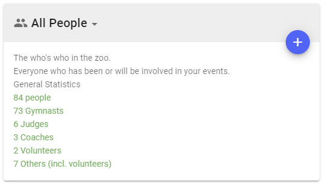
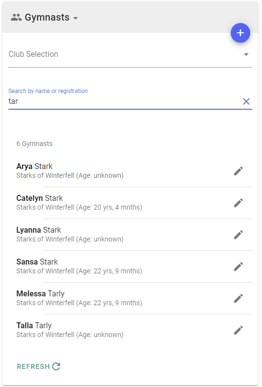
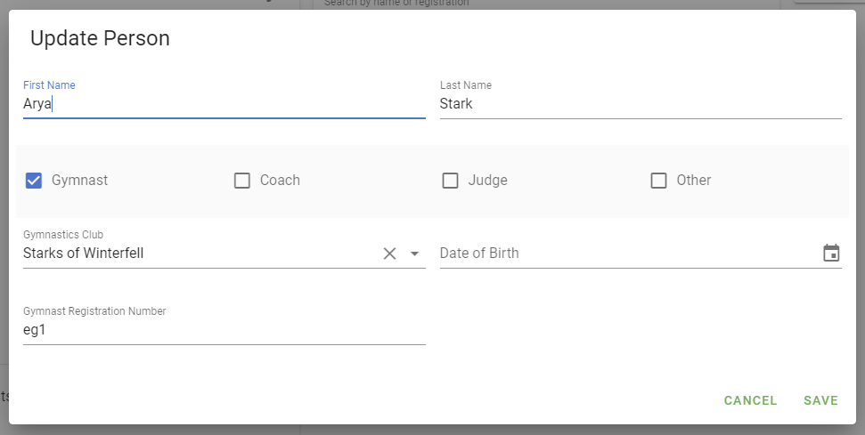

# Managing People

Within RGScores a person is a person. A person can have different roles, such as gymnast, judge, coach, and volunteer. They may only have one, and they may have all role at the same time.

The most important thing to remember is that if you are doing anything related to a person in RGScores, you only need to enter them into the system once.  The role(s) they have determines what they can do, and what the system can do with them.

## People summary

In the Administration area, the people card will show a summary of all the people in the system, grouped by roles.

Note that because some people may have multiple roles, it is possible for people to be counted twice or more. This means the total people count may not match the number you total the number of people across the different roles.

## Adding a person

To add a person, simply click the (+) button at the top right of the people card.

A dialog will appear where you can enter their details (see below). Click `Save` when done.

## Finding and editing a person

To search for a person, you need to know what role you're expecting to find them in.

Click on the `All People` drop down in the header of the people card. Selecting `All People` wlll show the summary screen. Selecting the specific roles will show a list of people in that role.

When you select any role, you will see a field for searching on name and registration. The  Gymnasts or Coaches views include a filter by club option as well.

Once you find the person you want, select their entry to bring up the details for editing.

## People - Details

#### First &amp; Last Name

Required details. Will be shown wherever names are displayed within the system

#### Roles

The options available are:

* Gymnast
* Coach
* Judge, and
* Other
  * Club Owner
  * Volunteer
  * Competition Organiser
  * Administrator

A person may have multiple roles at the same time. You do not need to create separate records for them. For example, a Gymnast who is also a Judge can have both the Gymnast and Judge role active.

#### Gymnastics Club

All people must belong to a Gymnastics club. If you have Judges and volunteers not affiliated with any club, we recommend creating a specific club called *Independents* and associated them with that club.

#### Date of Birth

Applies only to Gymnasts.

The date of birth is not required, but is very helpful in ensuring only gymnasts of the correct age can be entered in levels that have an age restriction.

#### Registration Number

The registration number is an optional field for Gymnasts, Coaches, and Judges. It is not used elsewhere in the system, and is intended for manual cross referencing of athletes and officials against an official registration system. The registration number does not have to be a number. At can be any text you want it to be.

Recording this information can be valuable when searching for people by their registration number.

#### Email Address

Required for all roles except Gymnast.

This is used for authentication purposes only. The email address should be email for the person's Google or Facebook account.

#### Child Safety Reference

Optional. For Coaches and Judges only.

As part of ensuring people working with children do not pose a risk, people involved in children's sport may need to have a valid government registration number. In Australia this is referred to as a "Working with Children Check". Other countries may have different names for the same type of check.

This reference number provides a way for organisation administrators to verify if people are allowed to work with children in a paid or volunteer capacity.

#### Expiry Date

Optional. The date on which the child safety reference will expire.

#### Other Roles

* *Club Owner*: currently unused
* *Volunteer*: Has permissions to use the score entry and floor marshal features
* *Competition Organiser*: Can create new competitions, and has full management permissions for the competitions they created. The cannot see or access competitions they did not create, and competition credits will be drawn from the club they are associated with.
* *Administrator*: Can manage all aspects of the system. This role should only be assigned to trusted people.
