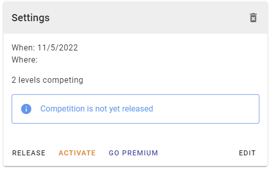

# Defining a Competition

::: tip
The basic steps you can follow to create a competition are covered in the Getting Started guide.
:::

It's best to think of Competitions as a series of Sessions. The competition defines the days when the session runs, and the sessions define who competes, when.

Put another way, a competition is the event, and the sessions are times during the event when different groups of athletes compete.

## Competition Creation

When you first create a competition, there are a limited number of settings available. This is so you can quickly create the competition, without needing all of the details to be available yet.

Only the name of the competition, its start date, and the competition type are required. All settings can be altered after creating the competition.

### Competition Types

The three types of competitions are used for determining who can create the competition, and the type of competition credit that will be used when the competition is released.

Competitions can either be run by an official Gymnastics Organisation (such as National or State/Province gymnastics organisations), or by Gymnastics Clubs.

Typically, an RGScores organisation is a Gymnastics organisation, and they may permit clubs to run multiple competitions throughout the year.

The available competition types are:

* Official Competition: Run by the Gymnastics Organisation.
* Sanctioned Competition: Run by a Gymnastics Club. Results from this competition may be used to qualify gymnasts for official competitions later in the year.
* Other/Club Competition: A competition run by a club to improve competition readiness. Can also be used by representative squads when running trial competitions prior to a major competition.

#### Understanding Competition Credits

To run a competition you must activate it, and to activate it you must use a Competition Credit.

Competition credits can be purchased by the Organisation or by Clubs. The purchaser will have credits allocated to either their organisation or their club.

* Official Competitions will consume Organisation credits. If none exist, a club credit will be consumed.
* Sanctioned and Clubs competitions will consume a Club credit. If no club credits are available, an organisation credit will be used.

It's important to understand the roles people have in the system and what this implies for credit consumption.

* People with the Administrator role can always use an organisation credit.
* People associated with a club, with either an Administrator or Competition Organiser role can use a Club credit.

For gymnastics organisations that support clubs running sanctioned/club competitions, it is recommended that only the organisation members be granted the Administrator role. This will reduce the chances of sanctioned/club competition organisers accidentally consuming organisation credits.

## Releasing and Activating

In order to run a competition and enter scores, you must **activate** it. A warning will appear on any competition that is not yet activated as a reminder.

Activation will consume one competition credit and cannot be undone. See [Understanding Competition Credits](#understanding-competition-credits) for more information on the types of credits and their usage.

Activation can happen at any time, even after releasing the competition.

### Releasing

Releasing a competition makes it visible to the public and prevents changes to the competition settings or session configurations.

A competition must be both released and activated for scores to be recorded.

If you do need to make a change, you can suspend the competition. This will remove the competition from the public view and prevent further score entry until the competition is re-released.

Making changes to the competition definition or structure will no remove any scores from the system. You will only clear the scores for a session if you regenerate a session's work order.

## Premium Features

::: warning Competition Credit Required
Certain competition settings are only available if you activate Premium features for the competition. Doing so consumes a competition credit.
:::

The features available for premium are:
* Disabling live scoring, and
* Making a Competition private

::: tip Why
RGScores believes live sport is more enjoyable when audiences are more engaged. Live scoring is central to that approach. Premium options give you the choice to forego that approach if your needs require it
:::

When a competition is private it will not be visible to the general public. It will still be visible to registered people (Administrators, Organisers, Volunteers, and Judges) as they will still need access to the system in order to record scores.

When live scores are disabled, the competition is still public and people can still track the progress of the competition, but scores will be withheld from the public. Scores will become available, but only become available 15 minutes after the session has been completed.

## Editing Settings

To edit the settings of a competition, click the edit button in the Settings card.

Note, you can also delete competitions by clicking the trash can icon at the top right of the settings card. This cannot be undone, so you will be prompted for confirmation before anything is deleted.

### Settings Details

#### Name

The name of the competition

#### Start &amp; End Dates

The dates during which the competition will run. The maximum competition length is 2 weeks.

#### Location

Free text to describe where the competition will be held.

#### Competition Type

See [Competition Types](#competition-types)

#### Organised By

Administrators automatically have full access to all competitions and can manage any competition. They do not need to be selected.

This field is only needed when a person with the `Competition Organiser` role needs to manage the competition.

If a Competition Organiser creates a competition, this field will automatically be set to their name.
If an Administrator creates the competition, they can select a Competition Organiser here, thus granting them permission to edit competition details.

#### Show Qualification Scores and Results

When enabled, this will show qualification scores for each level's results, and indicate the gymnasts who met the qualifying score by placing a 'Q' next to their scores in results views and PDFs.

Qualifying scores are just an indicator that a score requirement has been met. Organisations will have their own selection criteria, and are often more detailed than meeting a base qualifying score.

#### Allow Team Entries

When enabled, the competition will allow entries by teams per level. The criteria for team composition and the way team scores are calculated is determined by the [settings for each level](../administration/levels)

#### Competition Levels

The list of levels that will be competing across the competition. Sessions are later used to determine when the different levels in the competition will compete.

Competitions must have at least one level selected, and a level can only be removed from the competition if there are no entries for it.