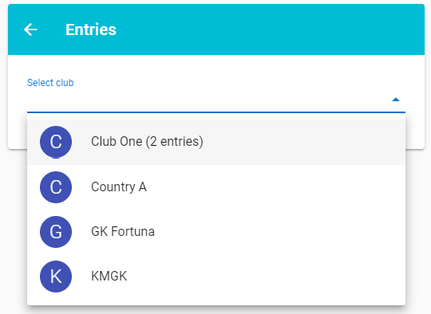
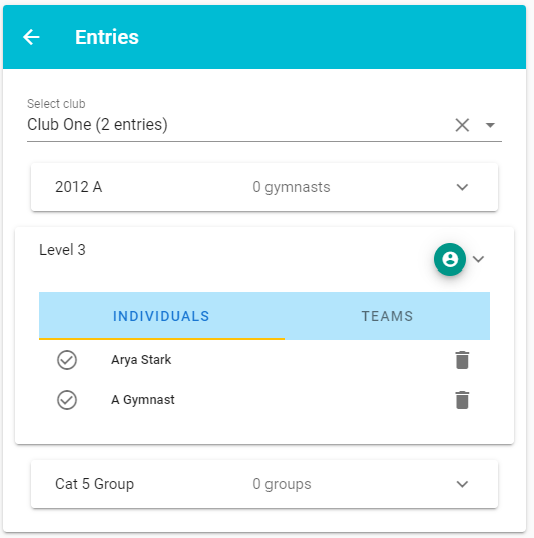
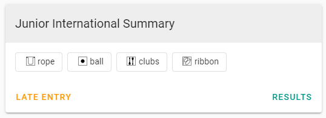

# Entries

The entry list for the competition is where you define all the gymnasts or groups that will be competing.

Entries are a list of gymnasts/groups by club, per level.

If a level does not have [pre-set music](../administration/levels#apparatus), each entry may optionally have a music track associated with each exerise/apparatus to be performed.

## Managing entries
The first step when editing entries is to select the club the entry belongs to. Typically, clubs supply entry lists, so selecting the club first should make it somewhat simpler to record the entries.

In the Clubs listing, any clubs with existing entries are listed first, along with their entry count. All other clubs & organisations are shown after that in alphabetical order.

Once you've selected a club, you'll see all the available levels for the competition listed, along with a summary of the entries per level.

Selecting a level expands the view to show the entry list for that club and level. If a competition also allows team entries, a tab to manage team entries will be shown alongside the individual entries.

If you remove a gymnast from the entry list, any team's they are a part of will also be removed.

::: tip AutoSave Enabled
Any changes made will be automatically saved as soon as you make them. You do not need to click a  `save` button. You do not need to worry about losing changes due to a temporary loss of connectivity whilst recording a large number of entries.
:::

The ticks you see indicate if an entry has been accepted or not. This is in preparation for a potential future update where support may be added for club owners to self-manage their entries so that competition organisers just have to accept or decline entries before each competition starts.

Once done, you can either select another club to add entries for, or you can click the back button at the top of the entry card.

## How to add a late entry

To add a late entry, go to the session details via the administration area. You should see the new Late Entry button in each level's summary view.

Click the button, fill in the details, click on Add, and a new entry will be added to the competition and new routines will be added to your session.

### Where do the routines get placed?

The rules for where we place new routines depends on how your session is arranged. The main rule we follow is that we don't disturb the order of existing routines where possible.

For sessions with a **single judging panel**, routines are added at the end of the rotation.

When there are **multiple judging panels and one competition floor**, we'll add the late routines to an appropriate gap in a judging panel, else they'll be added at the end of the rotation.

And for sessions with **multiple competition floors in parallel**, we'll look for any empty judging panels and fill them where possible, otherwise we'll add the routines at the end of the rotation.

### Notes

We ignore rules around grouping clubs together, starting routines on different panels, and keeping all routines in a level together. It's a last minute entry! We'll add the late entry to the session so they can compete, but we're not going to change the entire work order just because one gymnast wasn't entered until the day of the competition.

Keep in mind that adding a late entry won't show up everywhere automatically. You'll need to refresh any pages where the session work order is being displayed. This will include the score entry, scoreboard, and floor marshal pages.

And finally, if the entry is so late that scores have already been entered for others routines you can rest easy. Adding a late entry doesn't remove any existing scores.
