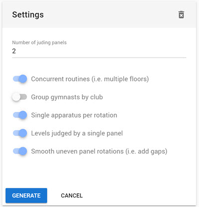
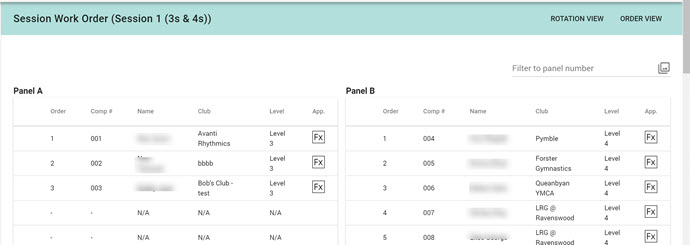
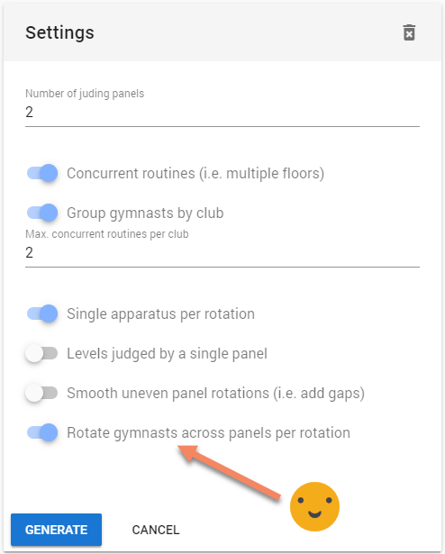
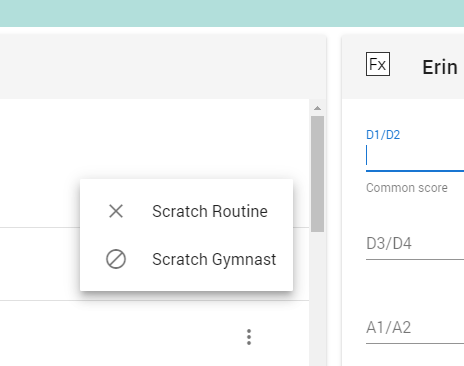

# Generating Work Orders

### Work orders and parallel levels

RG Scores has supported sessions where routines are run in parallel since the beginning, but until now we've only supported a single level being run in parallel at any time. This was to prevent the potential problems where routines from different levels are meant to be performed at the same time, but might have different music.

It also meant that judging for a single level would be performed by multiple panels. For beginner levels in some organisations this is perfectly acceptable, but in others it may not be desirable for this to occur.

With this release you can now arrange your session so that two different levels perform in parallel and have each level judged by a single, consistent panel for the entire session. This is primarily intended for levels split into subdivisions by age, such as, say, Level 3 Senior and Level 3 Junior.

This means the system won't know if a session makes sense or not when running two or more panels at once. In the example shown you can see I've mixed Level 3 and Level 4 into a single session, running in parallel. Would that make sense on the day? That's something you'd need to decide as the competition organiser.

### Spreading gymnasts more effectively when running parallel floors

For the beginner competition levels it's normal practice to run sessions using multiple floors in parallel (concurrent routines) and have common music.

When generating a work order the gymnasts in a level can be spread across all the floors at once, reducing the time it takes to complete the competition and with this update you can now ask the system to also avoid any anchoring of gymnasts to judging panels.

This new "rotate gymnasts across panels" option is only available when you have multiple panels, are running multiple floors in parallel, and you do not select the "levels judged by single panel" option.

Enabling the new option keeps the performance order the same, and places gymnasts on a different panel for each rotation. If there are more rotations than panels then there will some unavoidable repetition.

The system will respect any limits to the number of gymnasts from a club that can perform at once. For example, you may have 4 floors available but choose to limit the number of gymnasts from a single club competing at the same time to 2 so that the coaches can get their gymnasts on and off the floor effectively. Doing so will try to minimize any panel repetition, but is dependent on the competition and gymnast mix.

We trust that you find this new option useful and any feedback is always welcome.

### Small improvement to gymnast entries

When entering gymnasts into a competition you will now see each gymnast's individual competition level next to their name. Additionally, gymnasts are now sorted on first name basis, not their last name.

Seeing a gymnast's level name should help with validation of competition entries and can removing ambiguity around which gymnast is which when two gymnasts have the same name.

Additionally, the gymnast listing for individual competition entry will now only show gymnasts registered in an individual level. Gymnasts who only compete in multiples and groups will not be listed.

### Scratching via the Score Entry screen

Not all competitions are run with a floor marshal. Currently a late withdrawal for a competition require a data entry person to exit the score entry view, switch over to the floor marshal menu, perform the scratching, and then head back to the score entry screen again.

With this update you can now scratch a gymnast or routine directly from the score entry screen by clicking the action menu for a routine (the three dots).

You can also undo a scratching from the same menu, just in case you make a mistake.

 

#### Multiples and Groups can have just one gymnast

For some school based competitions only multiples and groups are competed and there is no tracking of the gymnasts in the groups entered by each school. They just track the group name and the school and the level they're competing in.

To better support these competitions, RG Scores now allows groups and multiples to have a minimum gymnast count of one (1). This allows the competition organisers to create a "pseudo-gymnast" as a placeholder gymnast for each group and to add that fake gymnast as the only member of each competition group, trio or pair.
