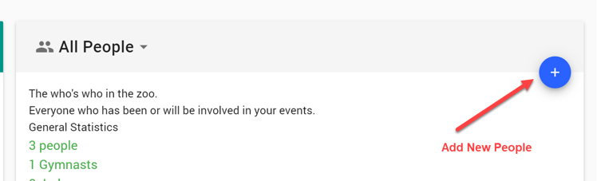

# Getting started

This is a quick walkthrough of the things you’ll need to do to get up and running. If you're after more specific help, just get in touch.

## Sign in

Browse to https://app.rscores.com and log in by clicking the icon at the top right of the page. Choose either the Google or Facebook options (the other options are for internal use only)

## Create Levels and Clubs

Go to the administation menu and create the appropriate levels and clubs, via the “Setup” card on the page

If you allow visiting clubs from other organisations you can mark them with the "Out of Area" flag.

You may also want to consider using an “N/A” level for gymnasts who only compete in groups/multiples, but not in individual competitions.

## Create a volunteer account (optional)

We strongly suggest creating a separate user account specifically for volunteers to use when helping with data entry and floor marhalling. Create the account as either a new Google account, or create a new email address of your choice and use it to login via Facebook. and add them as a volunteer.

To add a volunteer create a new person in the system, choosing the “Other” flag in the options and enter the new email address you created. Finally give them the “volunteer” permissions.

## Add gymnasts

Add all the gymnasts who will be competing at your competition.

At this point we don't support in import process (it's on our to-do list) so you'll have to manually enter everyone at this point.

While it might be a little painful, it's a one-time exercise. Once gymnasts are in the sytem you won't need to re-enter them every competition.

## Create a competition

In the competitions card (in the administration menu), click the add (+) button and create a new competition. Easy!

Next, click the competition to go to the competition details page. Here you can adjust the details and add more information by clicking the Edit button on the Settings card.

You'll see reminders telling you to add the levels and divisions that will be competing in your event. Add them 😉

## Add the clubs and gymnasts that are competing

First, add each of the clubs who have entered

Next, add the gymnasts entered for each club. The drop down box will let you select all gymnasts to make it quicker.

Optionally, add any groups or multiples that are competing.

And finally, if you are giving out any teams awares, you can enter team entries as well.

## Configure your sessions

Add sessions as needed (the level entry summary gives some timing approximations to help you. And don't forget you can change the details of any session as needed.

Don't forget to select the levels competing in each session.

## Create a work order

The fun step! Once you’re ready, click the “Generate Work Order” button, selecting the rules you want to use and click the button. It should generate in a fraction of a second, saving you hours of work.

Examine the generated work order by clicking the “View Work Order” button (there’s 3 different views you can use to get a feel for how the session will run)

If you’re not happy with it, or you have changes, you can simply generate it again. No problem at all.

## Publish it

When you've finalised entries and work orders, you can publish the competition. This will lock it for changes and make it visible to others.

At this point you may also want to produce paper work orders. You can do so via the two Work Order PDF buttons in each session. You'll see a PDF something like this, with your logo, instead of someone elses 😊

## You're ready to run

Score entry should be self explanatory and you can explore the features without a problem.

I think that should be enough to get you started 😊

Oh, if you want a private competition to learn with, let us know and we'll help you out.

P.S. If a gymnast withdraws after the competition is published, you can scratch them using the floor marshal menu. Scratching an gymnast prevents scores being accidentally entered for them, and they'll be displayed with a line through their names on both the session views and any work order PDFs you re-print.
