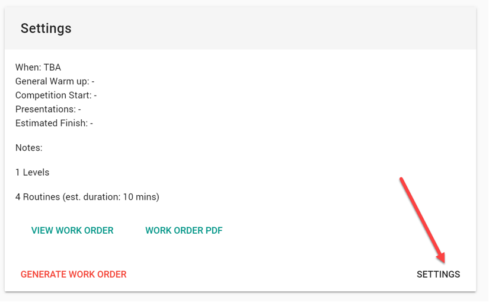
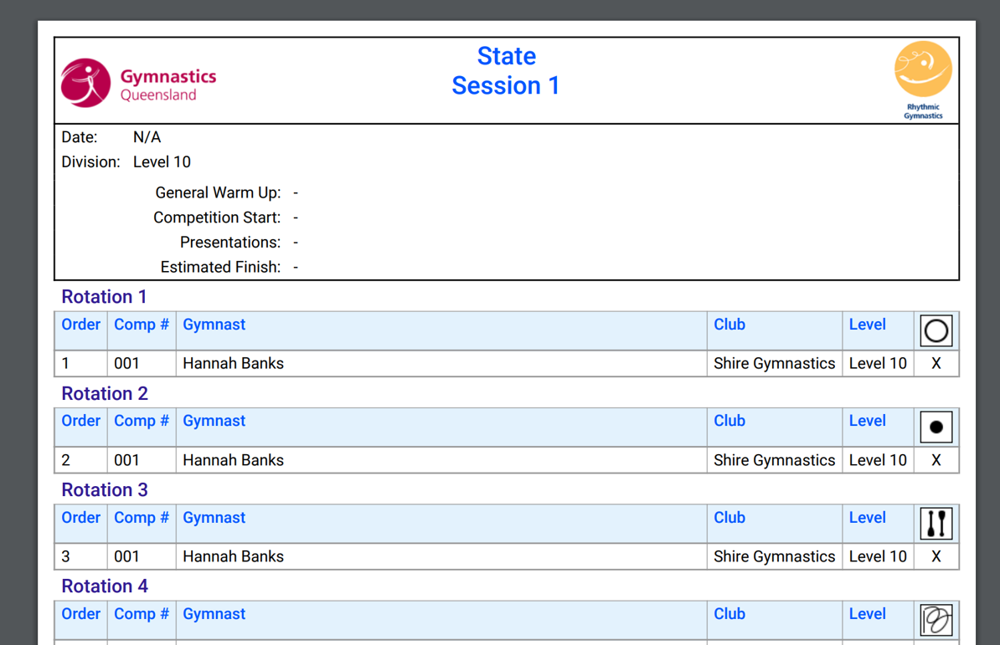

# Getting started

::: tip You need an organisation
If you don't yet have an RG Scores organisation set up, please get in touch via our [Contact page](https://rgscores.com/contact/) to ask for a free trial.
:::

## Sign In

1. Browse to https://app.rscores.com (you can click the RGScores App link at the top of these docs)
2. Ensure you are using the correct organisation. Use the `Switch To..` menu option to change if needed. 
3. Sign in by clicking the Sign In icon on the right side of the site header. 
4. Complete the sign-in process using either the Google or Facebook options

## Create clubs and competition Levels

1. Click on `administration` in the left hand menu.
2. You will see a `Setup` card on the page, with links to Clubs, Levels, and System Settings.
3. Create a club by clicking on the `Clubs` link, and then on the (+) button at the top right.
4. Enter the name of the club, and click `Save`.
5. Repeat the process to create the other clubs you need. If you allow visiting clubs from other organisations you can mark them with the "Out of Area" flag.

Once you have added your clubs, you will need to add your competition levels or divisions.

See the [Competition Levels](./administration/levels.md) page for further details.

## Create a volunteer account (optional)

We strongly suggest having a separate user account specifically for volunteers to use when helping with data entry or floor marshalling.

To add a volunteer create a new person in the system, choosing the “Other” flag in the options and enter the new email address you created. Finally give them the “volunteer” permissions.

See the [People](./administration/people.md) page for more information on how to add people to the system.

## Add gymnasts

Add all the gymnasts who will be competing in your competitions.

See the [People](./administration/people.md) page for more information on how to add gymnasts to the system.

::: info
Adding many people be a little repetitive, but thankfully it's a one-time exercise. Once a gymnast is in the system you won't need to re-enter their details anywhere else.
:::

## Create a competition

1. Click on `administration` in the left hand menu.
2. In the `competitions` card, click the add (+) button to create a new competition.
3. Supply the basic information about the competition, and click `Save`.

The competition will then be shown in the upcoming list of competitions.

Select the competition to go to the competition management page, where you can manage entries, add sessions, and alter the competition settings.

You'll see reminders telling you to add the levels and divisions that will be competing in your event.

## Add the clubs and gymnasts that are competing

First, add each of the clubs who have entered

Next, add the gymnasts entered for each club. The drop down box will let you select all gymnasts to make it quicker.

Optionally, add any groups or multiples that are competing.

And finally, if you are giving out any teams awares, you can enter team entries as well.

## Configure your sessions

Add sessions as needed (the level entry summary gives some timing approximations to help you. And don't forget you can change the details of any session as needed.

Don't forget to select the levels competing in each session.

## Create a work order

The fun step! Once you’re ready, click the “Generate Work Order” button, selecting the rules you want to use and click the button. It should generate in a fraction of a second, saving you hours of work.

Examine the generated work order by clicking the “View Work Order” button (there’s 3 different views you can use to get a feel for how the session will run)

If you’re not happy with it, or you have changes, you can simply generate it again. No problem at all.

## Publish it

When you've finalised entries and work orders, you can publish the competition. This will lock it for changes and make it visible to others.

At this point you may also want to produce paper work orders. You can do so via the two Work Order PDF buttons in each session. You'll see a PDF something like this, with your logo, instead of someone elses 😊

## You're ready to run

Score entry should be self explanatory and you can explore the features without a problem.

I think that should be enough to get you started 😊

Oh, if you want a private competition to learn with, let us know and we'll help you out.

P.S. If a gymnast withdraws after the competition is published, you can scratch them using the floor marshal menu. Scratching an gymnast prevents scores being accidentally entered for them, and they'll be displayed with a line through their names on both the session views and any work order PDFs you re-print.
